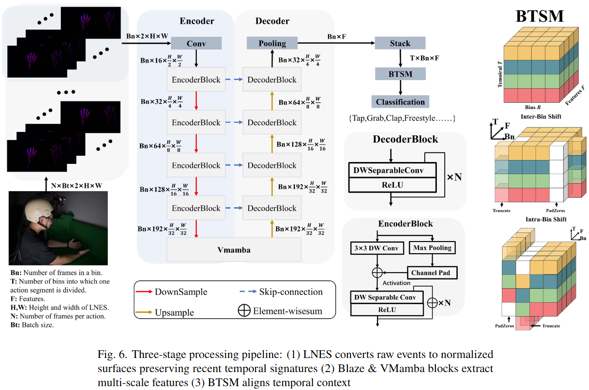

# EgoEv-Gesture
Official PyTorch implementation of the paper "EgoEv-Gesture: Gesture Recognition Based on Egocentric Event Camera". Includes code, pre-trained models, dataset links, and experiment results.

## News
- [2025/02]: We release our code!
- [2025/02]: We release our dataset!
 

## Abstract
Egocentric gesture recognition is a pivotal technology for enhancing natural human-computer interaction, yet traditional RGB-based solutions suffer from motion blur and illumination variations in dynamic scenarios. While event cameras show distinct advantages in handling high dynamic range with ultra-low power consumption, existing RGB-based architectures face inherent limitations in processing asynchronous event streams due to their synchronous frame-based nature. Moreover, from an egocentric perspective, event cameras record data that include events generated by both head movements and hand gestures, thereby increasing the complexity of gesture recognition. 
To address this, we propose a novel network architecture specifically designed for event data processing, incorporating (1) a lightweight CNN with asymmetric depthwise convolutions to reduce parameters while preserving spatiotemporal features, (2) a plug-and-play state-space model as context block that decouples head movement noise from gesture dynamics, and (3) a parameter-free Bins-Temporal Shift Module (BSTM) that shifts features along bins and temporal dimensions to fuse sparse events efficiently.
We further build the EgoEvGesture dataset, the first large-scale dataset for egocentric gesture recognition using event cameras. Experimental results demonstrate that our method achieves 62.7\% accuracy in heterogeneous testing with only 7M parameters, 3.1\% higher than state-of-the-art approaches.

## Dataset
The Dataset can be downloaded via the following link: https://pan.baidu.com/s/1o4dyxnJGe9aNCpM7w4CY4g?pwd=hjsn

## Method
|  | 
|:--:| 

## TODO
- [x] Dataset Release
- [ ] Paper Release
- [x] Code Release

